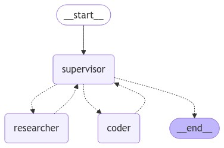

# Multi_Agent AI Searchbot

This project presents a multi-agent AI Searchbot system integrated with a search engine and Python REPL, designed to handle complex user queries and perform Maths calculations, with a systematic approach. It leverages the capabilities of LangChain and LangGraph libraries, Tavily is integrated for search engine functionality and Python REPL is employed for executing complex mathematical computations. 

## Features

- **Multi-agent Systems:** 
The primary benefits of using multi-agent systems are:
 1) **Modularity:** Separate agents make it easier to develop, test, and maintain agentic systems.
 2) **Specialization:** You can create expert agents focused on specific domains, which helps with the overall system performance.
 3) **Control:** You can explicitly control how agents communicate (as opposed to relying on function calling).
 4) **Flexibility:** Agents can be easily added or removed from the system as needed.


The system incorporates **"divide-and-conquer"** approach: 
  - **Supervisor:** Based on the user's query  a supervisor agent will use a tool-calling LLM to decide which of the agent tools to call and as well as decides the arguments to pass to those agents.
  - **Router:** Based on the supervisor agent output,a Router will route and call the appropriate expert tools for performing the task.
  - **Expert_tool:** Expert_tool agent takes the user query as input arguments, performs the necessary action and produce the output and that output is then passed back to the supervisor agent.
  - **Supervisor:** The supervisor agent receives the output from the expert tool and decides whether any further action need to taken or generate the final response.


## Graph WorkFLow


## Tech Stack
- **LangChain and LangGraph:** Utilizes the advanced capabilities of these libraries to understand and navigate complex language constructs.

- **LangSmith:** It is a platform for building production-grade LLM applications. it allows you to debug, test, closely monitor and evaluate LLM application.

- **Groq:** It is fast AI Inference. The Groq LPU™ AI Inference Technology delivers that offers deterministic performance with low latency and supports both single-core and
  multi-core configurations, making it ideal for various AI applications.

- **Mixtral-8x7b**:  Mixtral 8x7B stands out for its ability to generate and understand human language with greater precision and versatility.It is a sparse Mixture-of-Experts (SMoE) model that uses only 39B active parameters out of 141B, offering unparalleled cost efficiency for its size.

- **Search Engine Integration:** Powered by Tavily Search API, it is a is a specialized search engine designed for Large Language Models (LLMs) and AI agents. It provides real-time, accurate, and unbiased information, enabling AI applications to retrieve and process data efficiently.

- **Python REPL Integration:** Utilizes the Python REPL for executing complex mathematical computations and ensure accurate results.

- **Streamlit Web Interface:** The project uses Streamlit for designing and deploying an intuitive web interface, enhancing user interaction and experience.


## How to Use Locally

1. **Clone the repository:**
```bash
git clone https://github.com/ShivaHareesh80/Multi_Agent_AI_Searchbot.git
```

2. **Install requirements.txt**
```bash
pip install -r requirements.txt
```

3. **Set up environment variables:**

   - Ensure you have the following API key,
     1) Groq API KEY
     2) LangChain API KEY
     3) Tavily APIKEY   
   
   - Make sure to create a `.env` file and store the your API key as following environment variables.
     1) `GROQ_API_KEY`
     2) `LANGCHAIN_API_KEY` 
     3) `TAVILY_API_KEY`
   
   
4. **Run main.py via Streamlit**
```bash
streamlit run main.py
```

## Built With

- [LangChain](https://langchain.com)
- [LangGraph](https://https://langchain-ai.github.io/langgraph/)
- [LangSmith](https://www.langchain.com/langsmith)
- [Groq](https://groq.com)
- [Mixtral](https://mistral.ai/en)
- [Tavily](https://tavily.com/)
- [Streamlit](https://streamlit.io)
- [dotenv](https://github.com/theskumar/python-dotenv)
- [typing](https://github.com/python/cpython/blob/3.13/Lib/typing.py)

## License

This project is licensed under the MIT License.


